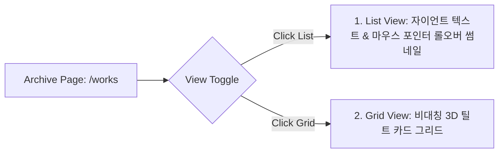
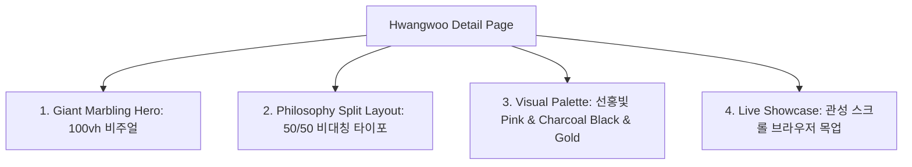

# 디자인 가이드 (V3.2 - Navigation & Detail Showcase)
<!--
제작자: UI/UX 디자이너 (Designer Agent)
컨셉: Hyper-Interactive Cyber Liquid (하이퍼 인터랙티브 사이버 리퀴드)
최종 수정일: 2026-06-24
-->

사용자의 새로운 요구사항인 **1) Works 카드 클릭 시 상세 페이지(`/works/:id`) 및 아카이브 페이지(`/works`) 연동**, **2) 아카이브 목록/그리드 토글 뷰 구현**, **3) 황우 시그니처 쇼핑몰 프로젝트 상세 쇼룸 디자인**을 위한 UI/UX 설계 및 마이크로 인터랙션 가이드라인 리비전 V3.2입니다.

---

## 1. 비주얼 컨셉 & 무드보드 (Moodboard)

### 시각 테마: **Hyper-Interactive Cyber Liquid (하이퍼 인터랙티브 사이버 리퀴드)**
*   **컨셉 정의**: 칠흑 같은 매트 블랙 공간에 떠다니는 입체적인 Z축 레이어들과, 마우스 움직임에 반응해 소용돌이치는 유기적 WebGL 액체 왜곡의 결합. 디자이너로서의 전위적인 크리에이티브와 퍼블리셔/풀스택의 하이엔드 개발 능력을 비주얼 퍼포먼스로 동시 입증합니다.
*   **톤앤매너**:
    *   **Overwhelming Scale**: 화면을 뚫고 나올 듯한 초광폭 자이언트 헤드라인.
    *   **Cyberpunk Contrast**: Obsidian BG 위의 **Vivid Hot Pink**와 **Neon Yellow** 네온 대비.
    *   **Z-axis Depth (Chipsa)**: 고정 그리드를 파괴하고, 요소들이 Z축 깊이감을 가지며 겹치는 입체 플로팅.
    *   **Liquid Fluidity (Buzzworthy)**: 매끄러운 가로 스크롤 전환과 마찰력 기반의 유기적 액체 반응.

---

## 2. 컬러 시스템 (Color Palette - V3.2)

| 역할 | 명칭 | HEX Code | 예시 및 용도 |
| :--- | :--- | :--- | :--- |
| **Primary BG** | Matte Obsidian Black | `#050508` | 전체 기본 배경색. 비비드 컬러의 채도를 극대화하는 깊은 암흑. |
| **Secondary BG** | Deep Void Space | `#0B0C10` | Z축 레이어링에서 뒤에 배치될 카드/오브젝트 표면색. |
| **Primary Accent** | **Vivid Hot Pink** | `#FF2D78` | 메인 포인트 컬러. 자이언트 타이포 클리핑, GNB 하이라이트, 패럴랙스 라인. |
| **Secondary Accent** | **Neon Yellow** | `#FFE000` | 보조 포인트 컬러 (극소 영역 1%). 기술 스택/트러블슈팅 성공 캡슐 태그. |
| **Divider Line** | Cyber Grid Line | `rgba(255, 255, 255, 0.08)` | Z축 겹침을 정교하게 표현해 줄 1px 미세 가이드 라인. |
| **Text Primary** | Absolute White | `#FFFFFF` | 자이언트 헤드라인 및 일반 본문. 극단적인 가독성 대비. |
| **Text Muted** | Slate Gray | `#64748B` | 메타 정보 및 미세 부연 설명용 텍스트. |

---

## 3. 아카이브 목록 페이지 (`/works`) UI/UX 설계

전체 포트폴리오를 탐색할 수 있는 아카이브 페이지는 정보를 컴팩트하게 정돈하는 **List View**와 비주얼을 강조하는 **Grid View**의 전환 구조를 통해 다차원적인 탐색 경험을 선사합니다.

### 1) 뷰 토글 컨트롤러 (View Toggle Controller)
*   **디자인**: 상단에 고정 배치되는 알약(Pill) 형태의 컴팩트 탭 바.
*   **스펙**: `border-radius: 99px`, 배경 `rgba(255, 255, 255, 0.03)`, 보더 `1px solid rgba(255,255,255,0.05)`. 활성화 시 슬라이딩 인디케이터가 **Vivid Hot Pink** 배경으로 스무스하게 채워지며 이동.

### 2) List View (최신순 정렬 텍스트 리스트)
*   **구조**: Space Grotesk 기반의 세련된 번호(01, 02)와 웅장한 Monument Extended 기반 프로젝트명 세로 정렬.
*   **인터랙션 (Floating Mini-Thumbnail)**:
    *   사용자가 특정 행(Row)에 마우스를 호버하면, 해당 행의 텍스트가 **Vivid Hot Pink** 네온 광원으로 빛나며 Y축으로 살짝 떠오릅니다.
    *   동시에, 마우스 커서의 물리 좌표를 뒤쫓는 **작은 Floating 썸네일 박스**가 화면에 스며들듯 나타나(Fade-in & Scale-up) 프로젝트의 핵심 디자인을 미리 보여줍니다.

### 3) Grid View (카드형 그리드 목록)
*   **구조**: 2-Column 또는 3-Column의 비대칭 격자 배치.
*   **인터랙션**: Chipsa 스타일의 Z축 입체 레이어 구조를 차용하여, 카드 호버 시 `Vanilla-tilt`로 마우스 각도에 반응하며 1px 테두리가 핫핑크 네온으로 활성화됩니다.

---

## 4. 프로젝트 상세 페이지 (`/works/:id`): 황우 브랜드 쇼룸 설계

예시 프로젝트인 **황우 시그니처 쇼핑몰**의 명품 한우 브랜딩 감성(안심, 등심·채끝, 본질의 가치)을 극대화하여 보여줄 수 있는 하이엔드 온라인 전시 카탈로그 형태의 상세 페이지 설계 사양입니다.

### 1) Giant Marbling Hero Section (첫인상 화면 장악)
*   **비주얼**: 화면 전체(100vh)를 꽉 채우는 황우 한우 특유의 명품 마블링 추상 그래픽(붉은 선홍빛과 어두운 그림자의 마블링 텍스트 오버레이)을 배경에 배치.
*   **타이포**: 웅장한 Monument Extended 서체의 자이언트 텍스트 `HWANGWOO BRANDING`이 화면 중앙에 안개(WebGL Liquid) 속에 가라앉아 있는 듯한 입체 텍스트 리빌로 나타납니다.
*   **메타**: 얇은 1px 그리드 라인 아래에 `ROLE: BRANDING / DESIGN / CAFE24 PUBLISHING`, `DATE: 2026` 등의 메타 정보가 Space Grotesk 서체로 단정히 배치됩니다.

### 2) Philosophy Split Layout (본질의 가치 타이포그래피)
*   **구조**: 50:50 좌우 비대칭 분할 레이아웃.
*   **우측 콘텐츠**: 황우의 선홍빛 등심과 채끝살의 결을 예술적인 흑백/고대비 클로즈업 사진으로 표현한 비주얼 카드.
*   **좌측 콘텐츠**: 본질의 가치와 장인 정신을 표현하기 위해, 고가독성 한글 서체(Pretendard Bold)를 사용하여 극단적으로 넓은 행간(`line-height: 2.0`)과 정밀한 자간으로 본문 텍스트 배치.
    *   *카피 예시*: *"등심의 곧은 결에서 시작되어 채끝의 단단함으로 완성되는 본질의 가치. 황우는 한우의 숯빛 어둠 위로 고고히 빛나는 선홍빛 마블링의 가치를 웹 위로 온전히 전개합니다."*

### 3) Visual Color Palette Matching (황우 브랜딩과 포트폴리오의 융합)
*   황우의 브랜드 컬러 스키마를 포트폴리오의 핵심 기술 토큰과 자연스럽게 오버레이합니다.
    *   **선홍빛 (Vivid Crimson)** ➡️ 포트폴리오의 **Vivid Hot Pink (#FF2D78)**로 융합하여 네온 싸인 글로우로 표현.
    *   **숯 / 깊은 전통 (Charcoal Black)** ➡️ 포트폴리오의 **Matte Obsidian Black (#050508)**으로 매핑하여 어둡고 진중한 분위기 연출.
    *   **고품격 황금빛 (Premium Gold)** ➡️ 포트폴리오의 **Neon Yellow (#FFE000)**로 융합하여 핵심 등급(Premium Grade) 라벨 배지에 활용.

### 4) Interactive Live Showcase & Troubleshooting
*   **디바이스 목업**: 실제 황우의 카페24 반응형 쇼핑몰 메인 페이지와 상품 디테일 UI를 투명한 브라우저 목업에 탑재합니다.
*   **자동 관성 스크롤**: 사용자가 스크롤을 내릴 때, 목업 내의 쇼핑몰 화면이 자연스럽게 하단으로 미끄러져 내려가 실제 구동되는 샵의 모습을 상세히 구경할 수 있도록 유도합니다.
*   **Troubleshooting Card**: 카페24의 낡은 레거시 테이블 아키텍처를 현대식 Grid/Flex 반응형으로 리빌딩하면서 극복해 낸 기술 장벽(예: 모바일 뷰포트 레이아웃 무너짐 해결, AI 연동 상품 자동 추천 파이프라인 연계 등)을 2개의 비대칭 **Troubleshooting 벤토 카드**로 하단에 정교하게 배치합니다.

---

## 5. 인터랙션 및 WebGL 물리 엔진 사양

### 1) WebGL Liquid Wave Distortion Canvas (마우스 반응 유체 왜곡)
*   **도구**: `Three.js` + `React Three Fiber (R3F)` + `GLSL Fragment Shader`

### 2) Chipsa-style Physics-based Hover (물리 기반 탄성 모션)
*   **도구**: `Framer Motion`의 물리 스프링 엔진 (`spring` transition)

### 3) Custom Blend Circle & Giant Hover
*   마우스가 따라다니는 투명 서클 커서가 링크나 카드 위에 닿으면 **Vivid Hot Pink**로 채워지며 거대화됩니다.
*   상세 페이지의 황우 브랜딩 썸네일에 호버 시, 커서 내부에 **"VISIT SHOP"** 텍스트가 **Neon Yellow (#FFE000)** 네온 효과로 출력되어 실제 쇼핑몰 링크 이동을 자연스럽게 유도합니다.
