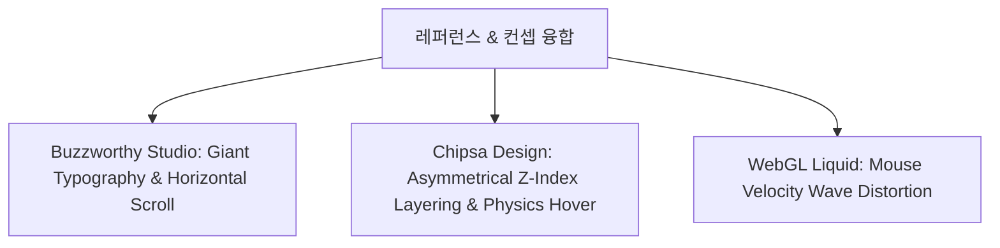
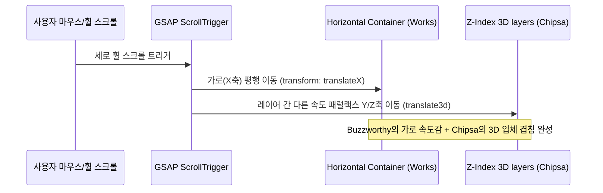

# 디자인 가이드 (V3.1 - Layout Refinement)
<!--
제작자: UI/UX 디자이너 (Designer Agent)
컨셉: Hyper-Interactive Cyber Liquid (하이퍼 인터랙티브 사이버 리퀴드)
최종 수정일: 2026-06-23
-->

사용자의 최종 확정 슬로건 및 최신 하이엔드 레퍼런스인 **Buzzworthy Studio**와 **Chipsa Design**의 연출 기법을 융합한 디자인 시스템 최종안(V3.1)입니다. 구현된 React 코드 레이아웃 분석에 기반하여, 절대 여백 배치, 슬라이딩 메뉴 패널 구조 및 하위 섹션과의 미적 정렬 규칙을 정교화하여 기재합니다.

---

## 1. 비주얼 컨셉 & 무드보드 (Moodboard)

### 시각 테마: **Hyper-Interactive Cyber Liquid (하이퍼 인터랙티브 사이버 리퀴드)**
*   **컨셉 정의**: 칠흑 같은 매트 블랙 공간에 떠다니는 입체적인 Z축 레이어들과, 마우스 움직임에 반응해 소용돌이치는 유기적 WebGL 액체 왜곡의 결합. 디자이너로서의 전위적인 크리에이티브와 퍼블리셔/풀스택의 하이엔드 개발 능력을 비주얼 퍼포먼스로 동시 입증합니다.
*   **톤앤매너**:
    *   **Overwhelming Scale**: 화면을 뚫고 나올 듯한 초광폭 자이언트 헤드라인.
    *   **Cyberpunk Contrast**: Obsidian BG 위의 **Vivid Hot Pink**와 **Neon Yellow** 네온 대비.
    *   **Z-axis Depth (Chipsa)**: 고정 그리드를 파괴하고, 요소들이 Z축 깊이감을 가지며 겹치는 입체 플로팅.
    *   **Liquid Fluidity (Buzzworthy)**: 매끄러운 가로 스크롤 전환과 마찰력 기반의 유기적 액체 반응.



---

## 2. 컬러 시스템 (Color Palette - V3.1)

| 역할 | 명칭 | HEX Code | 예시 및 용도 |
| :--- | :--- | :--- | :--- |
| **Primary BG** | Matte Obsidian Black | `#050508` | 전체 기본 배경색. 비비드 컬러의 채도를 극대화하는 깊은 암흑. |
| **Secondary BG** | Deep Void Space | `#0B0C10` | Z축 레이어링에서 뒤에 배치될 카드/오브젝트 표면색. |
| **Primary Accent** | **Vivid Hot Pink** | `#FF2D78` | 메인 포인트 컬러. 자이언트 타이포 클리핑, GNB 하이라이트, 패럴랙스 라인. |
| **Secondary Accent** | **Neon Yellow** | `#FFE000` | 보조 포인트 컬러 (극소 영역 1%). 기술 스택/트러블슈팅 성공 캡슐 태그. |
| **Divider Line** | Cyber Grid Line | `rgba(255, 255, 255, 0.08)` | Z축 겹침을 정교하게 표현해 줄 1px 미세 가이드 라인. |
| **Text Primary** | Absolute White | `#FFFFFF` | 자이언트 헤드라인 및 일반 본문. 극단적인 가독성 대비. |
| **Text Muted** | Slate Gray | `#64748B` | 메타 정보 및 미세 부연 설명용 텍스트. |

### 그라디언트 가이드 (Vivid Gradient Specs - V3.1)
*   **Brand Cyber Gradient**: `linear-gradient(135deg, #FF2D78 0%, #FFE000 100%)`
*   **Radial Neon Glow**: `radial-gradient(circle, rgba(255, 45, 120, 0.12) 0%, rgba(255, 224, 0, 0.04) 60%, rgba(5, 5, 8, 0) 100%)`

---

## 3. 타이포그래피 (Typography - Giant Wide Style)

Buzzworthy 스타일의 압도적인 레이아웃 핵심은 극도로 과감한 폰트 크기 배분(Giant Scaling)과 와이드 폰트의 채택입니다.

*   **영문 헤드라인**: `Monument Extended` (초광폭 산세리프) 또는 `Syne` (기하학적 아트 서체)
    *   *효과*: 가로 비율이 매우 넓어 화면에 글자 몇 개만으로 엄청난 타이포그래피 포스를 발산합니다.
*   **본문 및 국문**: `Pretendard` (전체 가중치 지원)
    *   *효과*: 넓은 영문 폰트 대비 깔끔하고 얇은 가독성(Contrast)을 확보하여 세련미를 줍니다.

### 타이포 스케일 (반응형 vw 단위 필수 적용)
*   **Hero Main Title**: `10vw` ~ `12vw` (화면 너비의 10% 크기로 동적 스케일링, 최소 `120px` ~ 최대 `180px`) / Line Height `0.9` / Weight `900`
*   **Section H2**: `6vw` ~ `8vw` (최소 `72px` ~ 최대 `110px`) / Line Height `1.0` / Weight `800`
*   **Body Text**: `16px` ~ `18px` / Line Height `1.8` / Weight `Regular (400)` / Color `#CBD5E1` (넓은 줄간격으로 자이언트 타이포와 대치되는 여유로운 가독성 형성)

---

## 4. 레이아웃 구조 (Asymmetrical Z-Layering & Horizontal Scroll)

고정식 벤토 그리드를 완전히 탈피하고, 요소들이 Z축 깊이감을 갖고 어긋나며 가로로 진행하는 하이브리드 구조를 설계합니다.



### 1) Buzzworthy 스타일: Giant Horizontal Scroll (가로 스크롤)
*   **대상 영역**: `Works` (포트폴리오 리스트) 섹션.
*   **구현 매커니즘**:
    *   방문자가 세로로 스크롤을 내릴 때, GSAP `ScrollTrigger`가 이벤트를 낚아채어 `Works` 컨테이너를 가로(`translateX`)로 밀어냅니다.
    *   가로로 밀려 나갈 때 화면 가득히 거대한 프로젝트 타이틀(`Monument Extended` 서체, 10vw 크기)과 목업 스크린샷이 화면 밖에서 안으로 시원하게 통과하도록 연출합니다.
*   **구현 핵심 코드 (GSAP 예시)**:
    ```javascript
    gsap.to(".horizontal-track", {
      xPercent: -100 * (slides.length - 1),
      ease: "none",
      scrollTrigger: {
        trigger: ".horizontal-section",
        pin: true,
        scrub: 1, // 관성 감도
        end: () => "+=" + document.querySelector(".horizontal-track").offsetWidth
      }
    });
    ```

### 2) Chipsa 스타일: Asymmetrical 3D Floating Layering (Z축 레이어링)
*   **대상 영역**: `About Me`, `Services` 섹션.
*   **구현 매커니즘**:
    *   격자 그리드를 무시하고, 텍스트 상자, 이미지 목업, 3D 오브젝트 카드가 임의의 영역에 배치됩니다.
    *   서로의 레이어가 겹치도록 설정하며, 레이어마다 `z-index`를 촘촘히 쪼개 배치합니다.
        *   *Background (z: 1)*: WebGL 유체 캔버스
        *   *Mid-Layer (z: 10)*: 1px 가이드 그리드라인 및 세부 정보 텍스트
        *   *Top-Layer (z: 20)*: **Vivid Hot Pink** 그라디언트 테두리가 둘러진 Chipsa형 3D 플로팅 카드
    *   스크롤할 때 각각의 Z축 레이어가 다른 속도로 위아래로 움직이는 **3D Parallax Y-axis Motion**을 통해 마치 공중에 오브젝트들이 정교하게 어지러진 듯한 깊이감을 줍니다.

---

## 5. 인터랙션 및 WebGL 물리 엔진 사양

### 1) WebGL Liquid Wave Distortion Canvas (마우스 반응 유체 왜곡)
*   **도구**: `Three.js` + `React Three Fiber (R3F)` + `GLSL Fragment Shader`
*   **매커니즘**: 
    *   배경 전체에 흐르는 핫핑크/네온옐로우 오로라에 마우스 커서의 물리적 '속도(Velocity)'와 '방향(Direction)'을 실시간 전송합니다.
    *   마우스를 빠르게 휙 낚아챌 때, 마우스 궤적 주변의 픽셀 좌표가 일그러지고 흐려지는(Distortion & Wave Wave) WebGL 셰이더 효과를 구동합니다.
*   **Fragment Shader 구동 컨셉**:
    ```glsl
    // GLSL Fragment Shader Concept
    uniform vec2 u_mouse;
    uniform vec2 u_velocity;
    void main() {
      vec2 uv = gl_FragCoord.xy / u_resolution.xy;
      float dist = distance(uv, u_mouse);
      // 마우스 속도에 비례한 UV 왜곡 계수 계산
      vec2 distortion = u_velocity * exp(-dist * 10.0) * 0.1;
      vec4 textureColor = texture2D(u_texture, uv + distortion);
      gl_FragColor = textureColor;
    }
    ```

### 2) Chipsa-style Physics-based Hover (물리 기반 탄성 모션)
*   **도구**: `Framer Motion`의 물리 스프링 엔진 (`spring` transition)
*   **효과**: 3D 카드를 마우스로 올리거나 클릭할 때, 일반적인 이징(Easing)이 아닌 텐션과 마찰력을 기반으로 튕기듯 반응하는 마이크로 물리 효과를 줍니다.
*   **피지컬 수치 설정**:
    *   `stiffness (탄성)`: 280 (빠르고 팽팽한 반응성)
    *   `damping (마찰)`: 18 (튕김 억제력, 튕김 현상이 2회 이내로 세련되게 마감되도록 조율)
    *   `mass (무게감)`: 0.8

### 3) Custom Blend Circle & Giant Hover
*   마우스가 따라다니는 투명 서클 커서(`border: 1px solid #FF2D78`, `mix-blend-mode: difference`)를 둡니다.
*   가로 스크롤 `Works` 섹션 내의 대형 프로젝트 카드에 호버 시 커서가 거대하게 커지며(scale(4)) 내부 텍스트로 **"VIEW PROJECT"**가 노란색(`Neon Yellow`) 네온사인 형태로 떠오릅니다.

### 4) Glowing Capsule Badges & Neon Round Tags
*   기획서의 핵심 태그 정보(예: Works의 주요 스택 및 Troubleshooting 카드 배지)는 다음과 같이 형광 라운드 태그 사양으로 매칭하여 자이언트 화면에서 정밀한 정보 위계를 완성합니다.
    *   **Vivid Hot Pink Tag**: `background: rgba(255, 45, 120, 0.06); border: 1px solid rgba(255, 45, 120, 0.25); color: #FF2D78; text-shadow: 0 0 5px rgba(255, 45, 120, 0.3); border-radius: 99px;`
    *   **Neon Yellow Tag**: `background: rgba(255, 224, 0, 0.06); border: 1px solid rgba(255, 224, 0, 0.25); color: #FFE000; text-shadow: 0 0 5px rgba(255, 224, 0, 0.3); border-radius: 99px;`

---

## 6. 레이아웃 조율 및 미적 분석 피드백 (V3.1 추가)

구현 코드(`App.jsx`, `FloatingMenu.jsx`, `GNB.jsx`) 검토를 기반으로 레이아웃 배치 구조의 미적 가치를 분석하고, 후속 개발 정합성을 위한 세부 스펙을 재조정합니다.

### 1) 히어로 섹션 절대 정렬 구조 (vh 기반 비대칭 배치)
*   **스펙 요약**: `LINE 1 (top: 19vh)` / `Floating Menu (top: 30vh)` / `Text Ticker (top: 53%)` / `LINE 2 (bottom: 13vh)`
*   **미적 및 조형적 가치 평가**:
    *   이 절대 정렬 구조는 뷰포트 높이(vh)를 기준 축으로 삼아, 스크린 높이에 가변적이면서도 요소 간 일정한 여백 비를 유지하게 합니다.
    *   좌측 정렬된 LINE 1과 우측 정렬된 LINE 2가 대각선 형태로 상반되게 위치하여 **비대칭형 시각 균형(Visual Balance)**을 형성합니다.
    *   LINE 1과 Ticker 사이의 빈 좌측 여백을 30vh에 위치한 슬라이딩 메뉴 버튼이 채워 안정감을 높이고, 정중앙의 53% 선을 관통하는 가로 텍스트 티커가 전체 비대칭 흐름에 무게 중심(Anchor)을 잡아 주어 정돈된 세련미를 줍니다.

### 2) 620px 슬라이딩 메뉴 패널 및 40px 볼드 메뉴 텍스트 (01~05)
*   **미적 가치 평가**:
    *   가로 620px로 확장된 메뉴 패널은 닫혀 있을 때의 양측 100px 대칭 마진 여백선과 조화를 이루어, 패널이 열렸을 때 화면에 시원한 에디토리얼 레이아웃(매거진 스타일) 볼륨을 만듭니다.
    *   패널 내부에 01~05 일련번호와 결합한 **40px 자이언트 볼드 텍스트**는 Buzzworthy 특유의 헤비급 타이포그래피 포스를 전달하여 정보 전달력과 크리에이티브를 극대화합니다.
    *   우측의 어두운 오버레이(Backdrop blur)와 패널 우측의 1px 미세 그레이 보더가 맞닿아 Cyber Liquid 공간 레이어링을 극명하게 드러냅니다.

### 3) 디자인 가이드 수정 및 명문화 스펙 (리비전 세부 사항)
*   **GNB 롤링 인포 슬라이더**: GNB 내부 우측에 `width: 280px`, `font-family: Space Grotesk`, `font-weight: 300`, `letterSpacing: 2px` 스펙으로 3초 간격 롤링 텍스트를 배치하고, 핫핑크 컬러 블링킹 닷 모션을 명시합니다.
*   **메뉴 토글 버튼 레이아웃**: `padding: 12px 20px`, `border-radius: 12px`, `background: rgba(20, 21, 26, 0.75)`, `border: 1px solid rgba(255, 255, 255, 0.1)`, `backdrop-filter: blur(12px)`. 호버 시 `scale(1.05)` 및 테두리 `var(--color-pink)` 변경 규칙을 스펙으로 선언합니다.
*   **메뉴 텍스트 호버 모션 최소화**: 자이언트 폰트(40px)의 직관적인 가독성을 해치지 않기 위해, 텍스트 호버 시 복잡한 3D 회전이나 물리 튕김 흔들림을 일절 배제하고 **스무스하게 핫핑크 컬러(`var(--color-pink)`)로만 변경하는 미니멀 호버 인터랙션**으로 단순화하여 고급스러운 매거진 무드를 유지합니다.

### 4) About Me 및 Works 섹션으로의 일관성 확장 제안
*   **About Me 비대칭 카드 레이아웃**:
    *   히어로 섹션의 좌우 100px 가이드 정렬선을 연장하여 적용합니다.
    *   About Me의 글라스모피즘 설명 카드를 화면 중앙에서 한쪽(예: 좌측)으로 치우치게 배치(약 60% 가로 폭)하고, 반대편 빈 공간에는 Monument Extended 서체로 거대한 영역 번호(`02 / ABOUT`)와 1px 세로 가이드 실선을 노출하여 장엄한 전시회 형태의 비대칭 미학을 통일시킵니다.
*   **Works 비대칭 가로 스크롤 카드 구조**:
    *   GSAP 가로 스크롤 진행 시 나열되는 프로젝트 카드 컴포넌트들을 동일한 사각형이 아닌, 크기와 세로 정렬선이 엇갈리는 비대칭(Asymmetrical Splitting) 구조로 설계합니다. (예: 첫 번째 카드는 상단 밀착, 두 번째 카드는 하단 밀착)
    *   카드 간격(Gutter)을 24px~80px로 다양하게 설정하여 수평 이동 시 리드미컬한 시각 변주를 제공하고, 각 카드 뒤편에 **Vivid Hot Pink (#FF2D78)** 또는 **Neon Yellow (#FFE000)**의 1px 정교한 수평/수직 구조선이 패럴랙스로 겹치며 지나가도록 연출(Chipsa 레이어링)하여 일관성을 완결합니다.
